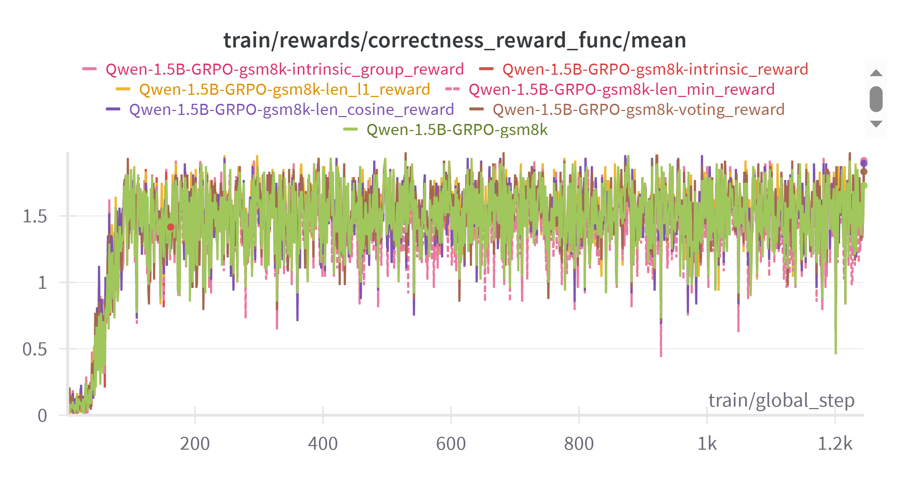
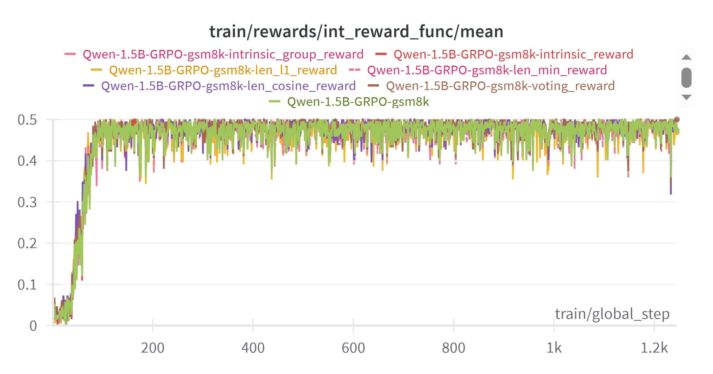
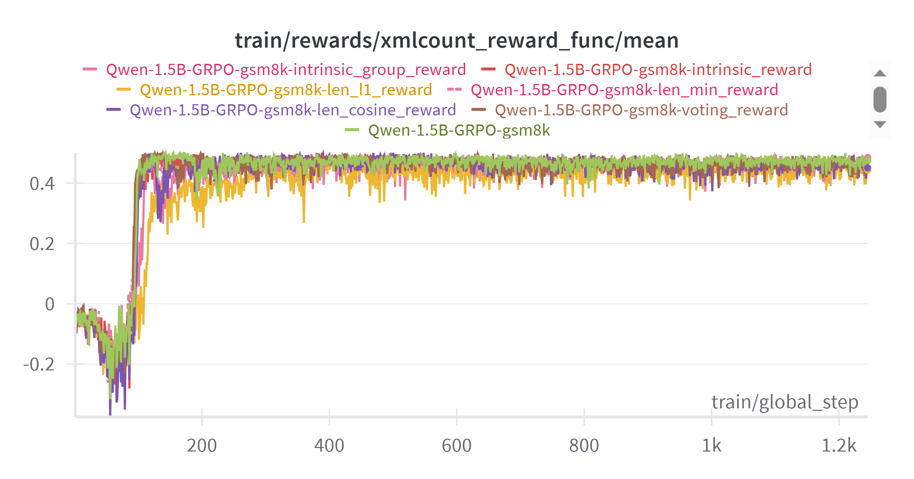
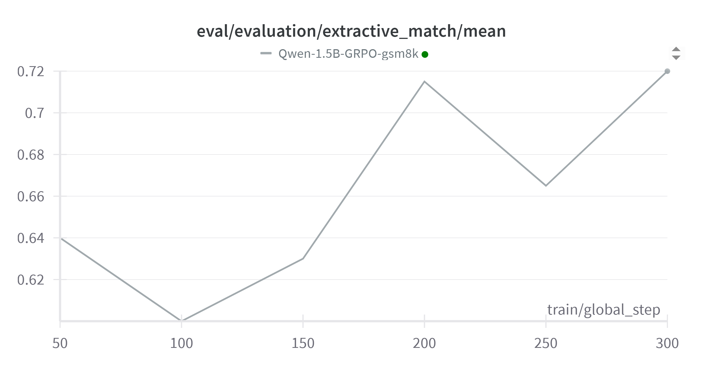

# R1

This repository contains the code for reproducing the **DeepSeek-R1** reinforcement learning phase, along with implementations of several recent and novel reward functions.

## Main Features
- Reproduction of the DeepSeek-R1 training phase.
- Support for custom evaluation functions to compute metrics on evaluation datasets during training.
- Implementation of recent length-based reward functions to enhance the reasoning capabilities of LLMs.
- New reward functions designed to promote diversity in generated responses.

## Folder Structure

```bash
R1                              # Root directory
├── recipes                     # YAML config files for different experiments
├── resources                   # Report and media files
├── scripts                     # Training and evaluation scripts
├── src                         # Source code for training
├── trl                         # Customized TRL library for RL training         
└── requirements.txt            # Python dependencies

## Installation
1. Install the modified TRL library
   Clone and install the forked version of TRL from:  
   [https://github.com/tienanh28122000/trl](https://github.com/tienanh28122000/trl)  
   This version includes support for custom evaluation functions and modifications for length-based reward functions.

2. Install required dependencies

```bash
pip install -r requirements.txt
```

## Training GRPO

The TRL library's [vLLM backend](https://huggingface.co/docs/trl/speeding_up_training?vllm+examples=GRPO#vllm-for-fast-generation-in-online-methods) is used to scale training to large models across multiple nodes. For single-node training of smaller models across multiple GPUs, follow these steps:

1. Start the vLLM server: Use one GPU to spin up the vLLM server:

```bash
cd scripts
bash run_vllm.sh
```

2. Run training: Once the server is up, run training on the remaining GPUs as follows:

```shell
cd scripts
bash train.sh
```

Note that the `train.sh` script will automatically select the appropriate YAML configuration file for the experiment (e.g., R1, length-based reward, etc.)

## Evaluation

To evaluate the trained model, run the following command:

```shell
cd scripts
bash eval.sh
```

This script calculates the extractive match metric. To customize or add new evaluation metrics, refer to the `task_tests.py` file for guidance on implementing custom metrics

For a detailed analysis of the model's response behavior, use the `analyze.py` script.

## Notes
- All experiment configurations for different reward functions are stored in the `recipes` directory. Each YAML file contains the training arguments for a specific experiment.
- For custom evaluation during training, refer to the latest commit of the forked TRL library: https://github.com/tienanh28122000/trl/commit/55249af2698942ee85db3e55c37e44dca21fc644 

## Training Experiments & Visualization

### List of experiments

1. R1 -> https://wandb.ai/tienanh28122000-vingroup/huggingface/runs/1u4o14qg?nw=nwusertienanh28122000
2. "L1: Controlling How Long A Reasoning Model Thinks With Reinforcement Learning" (https://arxiv.org/abs/2503.04697) -> https://wandb.ai/tienanh28122000-vingroup/huggingface/runs/fgstfwe7?nw=nwusertienanh28122000
3. "Demystifying Long Chain-of-Thought Reasoning in LLMs" (https://arxiv.org/abs/2502.03373) -> https://wandb.ai/tienanh28122000-vingroup/huggingface/runs/k8rv0303?nw=nwusertienanh28122000
4. "Training Language Models to Reason Efficiently" (https://arxiv.org/abs/2502.04463) -> https://wandb.ai/tienanh28122000-vingroup/huggingface/runs/aurxu9n0?nw=nwusertienanh28122000
5. Voting Reward -> https://wandb.ai/tienanh28122000-vingroup/huggingface/runs/myycfwsy?nw=nwusertienanh28122000
6. Group Intrinsic Reward -> https://wandb.ai/tienanh28122000-vingroup/huggingface/runs/ijx7h91v?nw=nwusertienanh28122000
7. Completion Intrinsic Reward -> https://wandb.ai/tienanh28122000-vingroup/huggingface/runs/488zswmt?nw=nwusertienanh28122000

### Visualization

- Correctness Reward: 


- Integer Reward:


- Xml Reward:


- Model's performance on the test data every 50 training steps (Extractive Match Metric):


## Acknowledgements

This repo builds upon the following resources:

- [trl](https://github.com/huggingface/trl): A reinforcement learning library.
- [open-r1](https://github.com/huggingface/open-r1): A full reproduction of R1 using the TRL library.
- [grpo_demo](https://gist.github.com/willccbb/4676755236bb08cab5f4e54a0475d6fb): A simple implementation for training reasoning LLMs with GRPO.
- [lighteval](https://github.com/huggingface/lighteval): A comprehensive toolkit for evaluating LLMs across multiple backends.
- [vllm](https://github.com/huggingface/lighteval): A fast and easy-to-use library for LLM inference and serving.